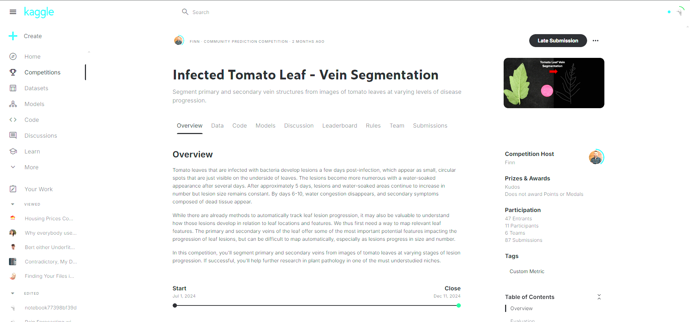

Main Repo for Leaf Vein Segmentation using UNet architectures and transfer learning
The project is a part of Machine Learning Marathon conducted by ML-X community at University of Wisconsin, Madison 
 