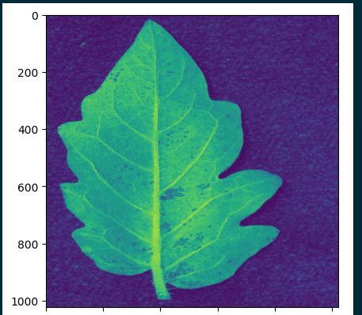
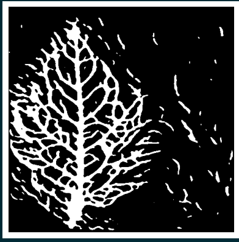

Main Repo for Leaf Vein Segmentation using UNet architectures and transfer learning  
The project is a part of Machine Learning Marathon conducted by ML-X community at University of Wisconsin, Madison 
 
  

 Given an leaf image our model, implemented using U-Net architecture employing transfer learning, finds the primary veins for the leaf. 
 
Given an input image, we apply preprocessing: channel selection, normalization, resizing, augmentation and CLAHE contrast enhancement. We get
 
   
 
Our model segments the veins
 
   